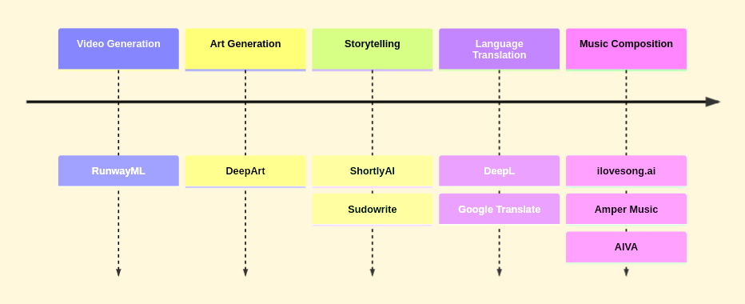
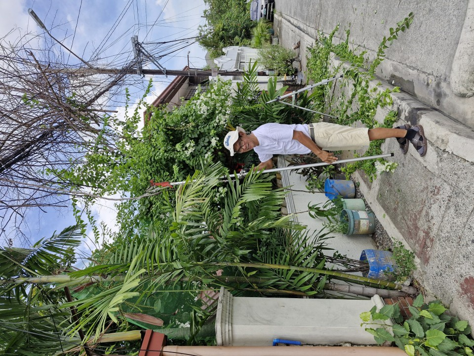
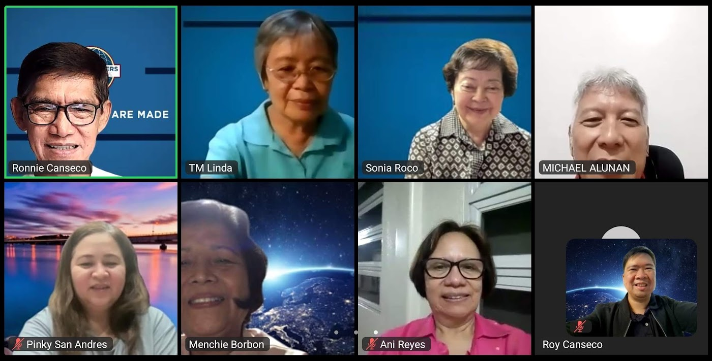
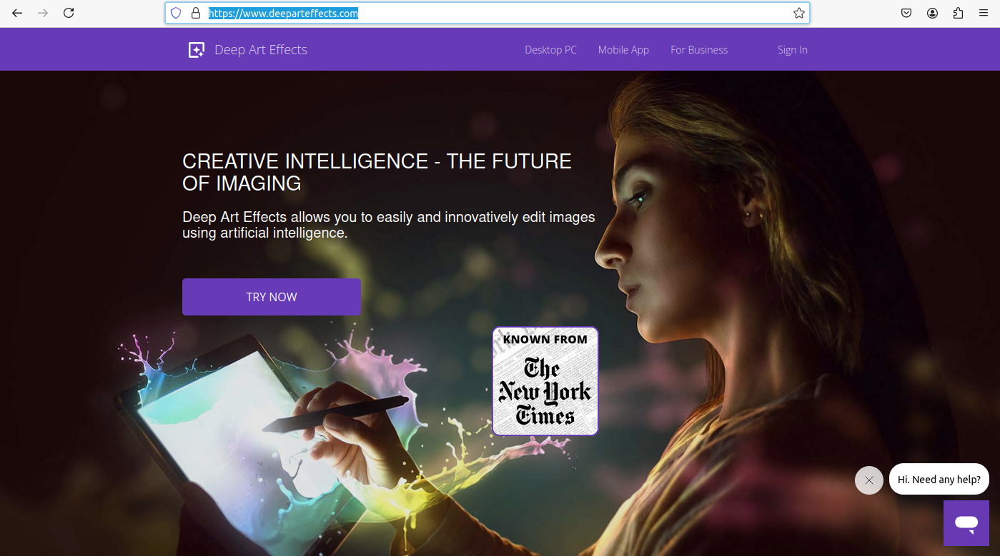
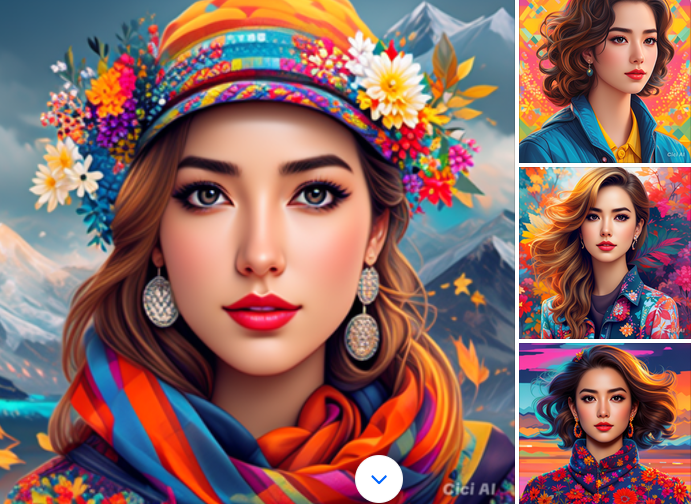
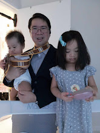

<!-- Add this anywhere in your Markdown file -->

<!-- _footer:  TMI District 75, Division A, Area 1 -->

**Sultan 
Toastmasters Club**

*Chartered 
April 1, 1981*

---

<!-- _footer: - -->

# 5 A.I. Uses in 5 Minutes

### *5AIU 5Min (pronounced sa'yo sa'min)*

 Prepared By:

Roy Vincent Canseco, CC VC5  
Sultan Toastmasters Club  
Area 1, Division A, District 75, TMI

---

# Speech Description

In line with PP Elma's theme of *AI Bane or Boon*, I want to talk about 5 exciting uses of generative Artificial Intelligence that can be done in 5 minutes or so. 

This will also serve as partial fulfillment of the requirements for the Research project in Level 1 of the Dynamic Leadership Pathway.

---

<!-- _footer: - -->

# 5 A.I. Uses in 5 Minutes

### Sultan Toastmasters 

#### July 16, 2024

 

# 

##### Roy Canseco 

---

# Talk Outline:

---

> # 1. Generate Videos

---

# Animate photos

<video controls src="img/Dad-trimming.mp4" Title="Dad vs Plant" loop></video>

---

## Prompt: 

> # A majestic and regal queen in front of her throne raising her scepter and blessing the people and the land

## Image guide:

---

## The result:

<video controls src="img/sonia-queen.mp4" title="Queen Ninang" style="width: 50%; height: auto;" loop></video> 

---

> # 2. Create Pictures

---

# Deep Art
 https://www.deeparteffects.com/

---

# Picture generation

Prompt: 

> ### Generate an image of a sample  digital art like depart or runwayML does

---

> # 3. Create a story

---

 Prompt:

> #  can you create a plot for a story located in a 5-star hotel that stands beside a depressed area like *shortlyai*?

> # Ensure the tone is Personal. Make it medium length, Write it in Filipino

---

## The result:

Sa isang 5-star na hotel na nakatayo malapit sa isang lugar na puno ng lungkot at pag-aalinlangan, nag-uumpisa ang kwento ng isang dalagang nagngangalang Sofia. Bilang isang front desk staff sa hotel, lagi siyang napapalibutan ng luho at kagandahan, ngunit sa kanyang pag-uwi sa kanyang maliit na apartment sa depressed area, nararamdaman niya ang bigat ng kanyang puso. Sa gitna ng magkasalungat na mundo, hinahanap ni Sofia ang kahulugan at layunin sa kanyang buhay. Sa bawat pagtakas sa kanyang realidad at pagtungo sa kanyang trabaho, natutuklasan niya ang kakaibang koneksyon sa isang misteryosong bisita na tila may itinatagong lihim. Sa pamamagitan ng paglalakbay sa pagitan ng dalawang mundo, matutuklasan ni Sofia ang katotohanan sa likod ng kanyang sariling pagkatao at ang kapangyarihan ng pagmamahal at pag-asa sa kabila ng mga hamon ng buhay.

---

> # 4. Create Translations

---

## The Plot in English

"The story of a girl named Sofia begins in a 5-star hotel located near a place filled with sadness and uncertainty. As a front desk staff at the hotel, she is always surrounded by luxury and beauty, but when she goes home to her small apartment in a depressed area, she feels the heaviness in her heart. In the midst of contrasting worlds, Sofia searches for meaning and purpose in her life. With every escape from her reality and journey to her work, she discovers a strange connection to a mysterious guest who seems to have a hidden secret. Through traveling between the two worlds, Sofia will uncover the truth behind her own identity and the power of love and hope amidst life's challenges."

---

> # 5. Create Music

---

Prompt:
> ## Style of Music: 
> ## epic, grand, majestic orchestral arrangement, powerful brass, sweeping strings, percussion, male voice

### Lyrics: 

[chorus]
In the land of Sultan, brave and true,
A leader strong, for me and you.
Guiding with wisdom, shining bright,
In the darkest hour, a guiding light.

---

#### The result:
<video controls src="sultan_lead/Sultan Lead-2.mp4" style="width:40%; height:auto" loop> </video>

---

# In summary:

---

# . 

# Thanks for listening!

# _

## Let's give A.I. a try! :D

---

# References

* Deep Art Effects: Be an artist! Turn your photos into awesome artworks. (n.d.). Deeparteffects. Retrieved 16 July. 2024, from https://deeparteffects.com.
* RunwayML. (n.d.). AI Video. ImagineArt. Retrieved 16 July. 2024, from https://imagine.art/.
* Cici. (n.d.). CiciAI. Retrieved 16 July. 2024, from https://ciciai.com.
* iLoveSongAI. (n.d.). Free Song AI Music Generator By SongAI | iLoveSong.ai. Ilovesong. Retrieved 16 July. 2024, from https://ilovesong.ai.

---

---

timeline
    Video Generation: RunwayML  
    Art Generation: DeepArt
    Storytelling: ShortlyAI
    : Sudowrite
    Language Translation: DeepL
    : Google Translate
    Music Composition : ilovesong.ai
    : Amper Music
    : AIVA

