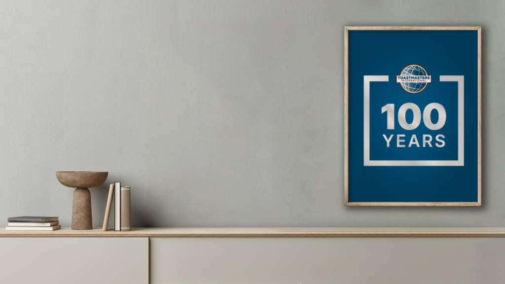

<!-- Add this anywhere in your Markdown file -->

<!-- _footer:  TMI District 75, Division A, Area 1 -->

**Sultan 
Toastmasters Club**

*Chartered 
April 1, 1981*

---

<!-- _footer: - -->

# 5 A.I. Uses in 5 Minutes

### *5AIU 5Min (pronounced sa'yo sa'min)*

 Prepared By:

Roy Vincent Canseco, CC VC5  
Sultan Toastmasters Club  
Area 1, Division A, District 75, TMI

---

# Speech Description

In line with PP Elma's theme of *AI Bane or Boon*, I want to talk about 5 exciting uses of generative Artificial Intelligence that can be done in 5 minutes or so. 

This will also serve as partial fulfillment of the requirements for the Research project in Level 1 of the Dynamic Leadership Pathway.

 <button > 

 

</button>

---

<!-- _footer: - -->

# 5 A.I. Uses in 5 Minutes

### Sultan Toastmasters 

#### July 16, 2024

 

# 

##### Roy Canseco 

---

# Deep Art
 https://www.deeparteffects.com/

---

I gave the following pro
---

 <button > 

[bit.ly/SultanSched](https://bit.ly/SultanSched) 

</button>

---

 <button > 

[bit.ly/SultanSched](https://bit.ly/SultanSched) 

</button>

---

 <button > 

[bit.ly/SultanSched](https://bit.ly/SultanSched) 

</button>

---

 <button > 

[bit.ly/SultanSched](https://bit.ly/SultanSched) 

</button>

---

 <button > 

[bit.ly/SultanSched](https://bit.ly/SultanSched) 

</button>

---

# Thanks for listening!

### Let's try it out

# -

<button>

[bit.ly/SultanSched](https://bit.ly/SultanSched)

</button>

---

# References

* Deep Art Effects: Be an artist! Turn your photos into awesome artworks. (n.d.). Deeparteffects. Retrieved 16 July. 2024, from https://deeparteffects.com.

---

timeline
    Art Generation: DeepArt
    : RunwayML 
    Music Composition : Amper Music
    : AIVA
    : add your names if willing to TME
    Schedule: Let's fill this up
    : Tentative is ok
    : If not available, fill-in a replacement
    Program: Automatically generated
    : to be copy-pasted to the chat
    Other sheets : Feel free to put important stuff

