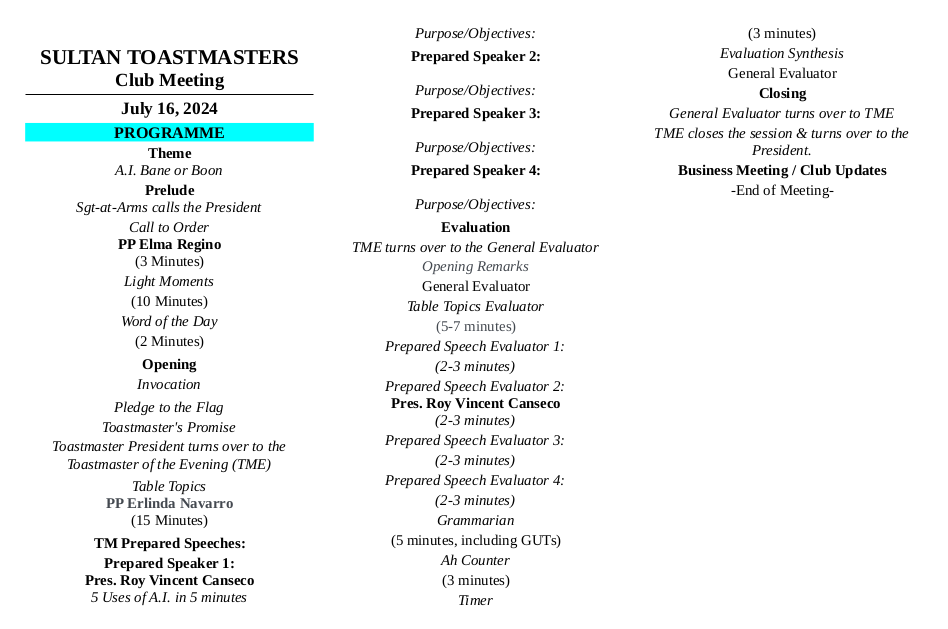
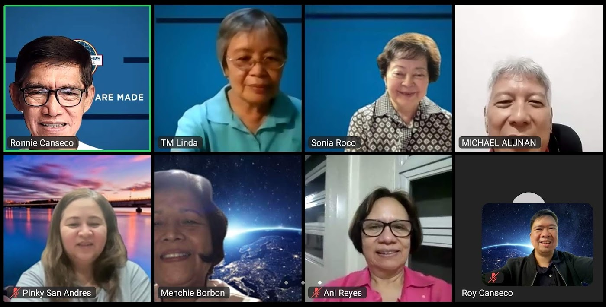
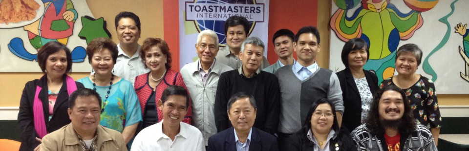

<!-- Add this anywhere in your Markdown file -->

<!--  -->

<!-- _footer:  TMI District 75, Division A, Area 1 -->

**Sultan 
Toastmasters Club**

Chartered 
#### April 1, 1981

---

<!-- _footer: _ -->

---

<!-- _footer: - -->

# Sultan Toastmasters Club

### Chartered April 1, 1981

#### TY 2024-2025

 

# ____  

##### Meetings every Tuesday via Zoom&trade;

---

# Purpose

To have fun and flexible Toastmaster meetings

# Values

1. Family-orientedness
2. Committment to Excellence
3. Cooperation 
4. Open-mindedness

# Vision

To be the Club of the Future, leading in developing the best communicators and leaders in their respective fields

# Mission

To provide a supportive and positive learning experience that empowers members to communicate and lead, resulting in  self-confidence and personal growth.

---

# History 

Headquartered in Rancho Margarita, California, the organization has more than 364,000 members in 16,200 clubs in 145 countries. Since it was founded by Ralph Smedley in 1924, TI has helped people of all backgrounds become more confident in front of an audience. 

The first TM club in the Philippines was established in 1935 but *Tamarraw Club* was the first club to be incorporated in 1953. It is also the first TM Club in Asia. *Sultan TMC* was established in April, 1981.

---

# Officers ***July 2024 -June 2025***

timeline
    President : Roy Canseco
    Vice Presidents : VP-Ed Menchie	Borbon
    : VP-Mem Pinky	San Andres
    : VP-PR Clarice	Medallo
    Secretary: IPP Elsa	Sabularse
    Treasurer: MVP Linda Navarro
    Sergent-at-arms : Mike Alununa

<!-- we can take inspiration from the TMI's path to success in order to fashion our own -->

---

<button>

# [Pledge of Allegiance](TM-flag_allegiance.mp3)

</button>

## _

I pledge my allegiance
To the flag of my country
And to the government for which it stands
With honor, justice and freedom
One Nation under God, 
indivisible, with justice, liberty 
and democracy for all

---

<button>

## [Toastmaster’s Promise](TM-promise.mp3)

</button>

As a member of Sultan Toastmasters Club, I promise to attend meetings regularly;
prepare all my speeches, fulfill meeting assignments, provide helpful evaluations, 
help the club maintain positive and friendly climate; 
serve my club when called upon to do so; 
bring guests to the club, and maintain honest and high ethical standards. 

---

## ***Speech Patterns***

### PREP
P- POINT (arresting introduction )  

R- REASON  (explain by giving reasons)   

E- EXAMPLES    

P- POINT (restate your point, call to  action,       
give a message, summarize points) 

### Story-Message-Gain
S - Story
M - Message 
G - Gain/moral of the story 

### AIDA
A– Attention,
I   - Interest, 
D  - Desire
A  - Action

### Other techniques

* Advantage/Disadvantages  
* PPF:  Past/Present /Future
* Compare and Contrast 
* Cause and Effect

