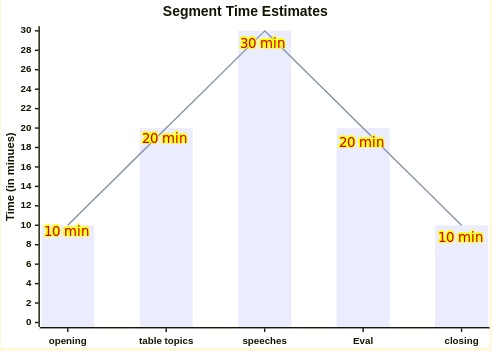

<!-- Add this anywhere in your Markdown file -->
<script src="https://cdn.jsdelivr.net/npm/mermaid@10/dist/mermaid.min.js"></script>
<script>
  mermaid.initialize({ startOnLoad: true });
</script>


<!-- _footer:  TMI District 75, Division A, Area 1 -->


<div style="height: 40vh">

**Sultan 
Toastmasters Club**

*Chartered 
April 1, 1981*


</div>


---


<div class="w3-row">

<div class="w3-col s5 w3-padding">

# Purpose

To have fun and flexible Toastmaster meetings

# Values

1. Family-orientedness
2. Committment to Excellence
3. Cooperation 
4. Open-mindedness

</div>

<div class="w3-col s7 w3-padding">


# Vision

To be the Club of the Future, leading in developing the best communicators and leaders in their respective fields

# Mission

To provide a supportive and positive learning experience that empowers members to communicate and lead, resulting in  self-confidence and personal growth.


</div>
</div>

---


# History 

Headquartered in Rancho Margarita, California, the organization has more than 364,000 members in 16,200 clubs in 145 countries. Since it was founded by Ralph Smedley in 1924, TI has helped people of all backgrounds become more confident in front of an audience. 

The first TM club in the Philippines was established in 1935 but *Tamarraw Club* was the first club to be incorporated in 1953. It is also the first TM Club in Asia. *Sultan TMC* was established in April, 1981.

---


<!-- _footer: - -->


<div class="w3-xxlarge w3-uppercase">

# Sultan Toastmasters Club

</div>

### Chartered April 1, 1981

#### TY 2024-2025

<br>

# ____  


##### Meetings every Tuesday via Zoom&trade;


---


# Officers ***July 2024 -June 2025***


<div class="mermaid w3-center">
timeline
    President : Roy Canseco
    Vice Presidents : VP-Ed Menchie	Borbon
    : VP-Mem Pinky	San Andres
    : VP-PR Clarice	Medallo
    Secretary: IPP Elsa	Sabularse
    Treasurer: MVP Linda Navarro
    Sergent-at-arms : Mike Alununa
</div>


<!-- we can take inspiration from the TMI's path to success in order to fashion our own -->


---


# [Pledge of Allegiance](TM-flag_allegiance.mp3)


I pledge my allegiance
To the flag of my country
And to the government for which it stands
With honor, justice and freedom
One Nation under God, 
indivisible, with justice, liberty 
and democracy for all


---
# [Toastmaster’s Promise](TM-promise.mp3)

<div class="w3-center">


</div>
As a member of Sultan Toastmasters Club, I promise to attend meetings regularly;
prepare all my speeches, fulfill meeting assignments, provide helpful evaluations, 
help the club maintain positive and friendly climate; 
serve my club when called upon to do so; 
bring guests to the club, and maintain honest and high ethical standards. 


---


## ***Speech Patterns***

<div class="w3-row">
<div class="w3-col s7 ">

### PREP
P- POINT (arresting introduction )  

R- REASON  (explain by giving reasons)   

E- EXAMPLES    

P- POINT (restate your point, call to  action,       
give a message, summarize points) 

### Story-Message-Gain
S - Story
M - Message 
G - Gain/moral of the story 

</div>
<div class="w3-col s5 w3-padding">


### AIDA
A– Attention,
I   - Interest, 
D  - Desire
A  - Action

### Other techniques

* Advantage/Disadvantages  
* PPF:  Past/Present /Future
* Compare and Contrast 
* Cause and Effect

</div>
</div>

---

<div class="w3-center">


</div>

---

<div class="w3-container w3-black w3-center" style="position: absolute; top: 50; left: 50;">
  <p class="w3-text-white" style="font-size: 50px; font-family: 'Courier New', monospace;">01</p>
</div>


<div class="w3-display-middle w3-jumbo">
  Vision
</div>

---


# Vision

* To have Zero membership problems
* To have new members wanting to come back because of the impact and benefit of the club in their personal development
* To have senior and core members get fulfilled from their continuous improvement and from making a difference in the lives of others

---

<div class="w3-container w3-black w3-center" style="position: absolute; top: 50; left: 50;">
  <p class="w3-text-white" style="font-size: 50px; font-family: 'Courier New', monospace;">02</p>
</div>


<div class="w3-display-middle w3-jumbo">
  Structure 
</div>


---


# Flexible Structure

* TMI meetings are expected to last 1-2 hours, with most lasting 1-1.5 hours. 
* Prospects and new members appreciate the minimal time commitment.
* the core meeting can be table topics, prepared speeches and evaluations
* we can have a pre-meeting (like a front act band) with the word of the day and the light moments
* we can have a post-meeting (like a business meeting) with lateral evaluations, planning, socials


---

## Time breakdown suggestion

<div class="w3-row">
<div class="w3-col s8">




</div>
<div class="w3-col s4">

| Toastmasters Meeting | Time Range (min) |
|---------------------------------|------------|
| Opening and Introductions     | 5-10  |
| Table Topics                    | 10-20  |
| Prepared Speeches               | 15-30  |
| Evaluations                     | 15-25  |
| Closing and Announcements          | 5-10  |


</div>


---


<div class="w3-xxxlarge">

> By keeping the core meeting within **90 minutes**, we can have a non-threatening time commitment  offering for new members and guests.  :)

</div>

---

<div class="w3-container w3-black w3-center" style="position: absolute; top: 50; left: 50;">
  <p class="w3-text-white" style="font-size: 50px; font-family: 'Courier New', monospace;">03</p>
</div>


<div class="w3-display-middle w3-jumbo">
  Impact 
</div>


---


# Share stories of impact

* We always encourage including personal experiences in speeches to foster authentic connection to the audience
* We all know of situations that could be improved or fixed with good communication or leadership
* We can share personal wins through communication and leadership  

---


<div class="w3-container w3-black w3-center" style="position: absolute; top: 50; left: 50;">
  <p class="w3-text-white" style="font-size: 50px; font-family: 'Courier New', monospace;">04</p>
</div>


<div class="w3-display-middle w3-jumbo">
  Inclusiveness 
</div>


---


# We can recognize concerns more

* some people can't stay for 2++ hours per meeting at this point in their life
* some people can't do a weekly meeting with preparations
* some people have a seasonal pattern of very busy months followed by more relaxed and free months
* some people can't pay full price every 6 months


---


# _


<div class="w3-xxxlarge">

> By figuring out ways for the club to create impact in the lives of new members and guests with their current resources (time, talent, treasure), they'll stay. Or if they go, they'll come back when they can.

</div>

---


<div class="w3-container w3-black w3-center" style="position: absolute; top: 50; left: 50;">
  <p class="w3-text-white" style="font-size: 50px; font-family: 'Courier New', monospace;">05</p>
</div>


<div class="w3-display-middle w3-jumbo">
  Modernizing 
</div>


---


# Zooming with A.I.

* Hybrid meetings won't go away. How about F2F once a month while jointly celebrating birthdays? 
* AI isn't coming, it's here. How about assuming it's in play baseline while learning to put it to use?

---


# In summary

* We want the club to live with happy members who come back, stay and pay. 
* We want to flex our structure to accommodate more such new members
* We want to figure out how deliver and acknowledge value and impact
* We want to accommodate individual circumstances into club expectations 
* We want to continue to evolve and be relevant in a world of hybrid meetings and A.I


---


<div class="w3-xxxlarge">

# Thanks!

### Do you have any questions?

#### __

roy@pshs.edu.ph

</div>


---

---

<div class="w3-row">
<div class="w3-col s8">

# Teacher and I.T. Practitioner 

<div class="w3-xlarge">
<p>I have had the privilege of teaching at various institutions, including the Institute of Electrical and Electronics Engineering (IEEE), the Department of Computer Science (DCS) and the Virata School of Business  at the University of the Philippines Diliman (UPD). During my time at UPD, I actively contributed to the development of UPD's Moodle-based UVLe LMS as a Project Development Associate.
</p>


Currently, I am teaching at Philippine Science High School - Main Campus, where I served as the head of the Information Technology Unit (MIS) during the deployment of our Moodle-based Learning Management System called KHub.
</div>

</div>
<div class="w3-col s4 w3-center">


<hr>

<div class="w3-right">
Roy Canseco 
<p class="w3-xlarge"> 
CS Teacher , MIS - PSHS-MC
</p>
</div>


</div>
</div>

---


<!-- _footer: _ -->
<!-- paginate: true -->


According to a study funded by Google, under the direction of ACM, and in partnership with Microsoft:
<br>

<div class="w3-xxxlarge">

> "Computer science educators often struggle with limited access to **up-to-date materials**, **software**, and **hardware**"
> <span class="w3-right"> -University of Chicago Study </span>

</div>

<div class="w3-bottom w3-medium">
1) Century et al. 2013. Building an Operating System report. https://outlier.uchicago.edu/computerscience/OS4CS/challenges/. Accessed 2024
2) Doug Konopelko. 2024. Building an Operating System report. https://outlier.uchicago.edu/computerscience/OS4CS/challenges/. Accessed 2024
</div>

---


<div class="w3-container w3-black w3-center" style="position: absolute; top: 50; left: 50;">
  <p class="w3-text-white" style="font-size: 50px; font-family: 'Courier New', monospace;">01</p>
</div>


<div class="w3-display-middle w3-jumbo">
  VPL - Virtual Programming Laboratory
</div>


---


<div class="w3-row"> 
  <div class="w3-col s3">

  # Benefits

  ### Virtual Programming Laboratory

  </div>
  <div class="w3-col s9">
<div class="mermaid">
mindmap
  root(("Moodle VPL"))
    **Student** 
    ::icon(fas fa-user-graduate)
      Interactive      Programming      Assignments
      ::icon(fas fa-terminal)
      Web-Based Programming Environment
      ::icon(fas fa-laptop-code)
      Secure Sandbox Environment
      ::icon(fas fa-shield-alt)
    **Teacher**
    ::icon(fas fa-chalkboard-teacher)
      Support for Multiple Programming Languages
      ::icon(fas fa-code)
      Automatic Grading and Feedback
      ::icon(fas fa-check)
      Plagiarism Checker
      ::icon(fas fa-user-secret)
    

</div>
  </div>

</div>


<!-- this potentially alleviates the software and hardware problem-->


---


<div class="w3-container w3-black w3-center" style="position: absolute; top: 50; left: 50;">
  <p class="w3-text-white" style="font-size: 50px; font-family: 'Courier New', monospace;">02</p>
</div>


<div class="w3-display-middle w3-jumbo">
  Recent Studies on A.I. for Computer Science Education
</div>


---


<!-- _footer: Becker, B. A., Denny, P., Finnie-Ansley, J., Luxton-Reilly, A., Prather, J., & Santos, E. A. (2023). Programming Is Hard – Or at Least It Used to Be: Educational Opportunities and Challenges of AI Code Generation. In Proceedings of the 54th ACM Technical Symposium on Computer Science Education V. 1 (SIGCSE 2023), March 15–18, 2023, Toronto, ON, Canada. https://doi.org/10.1145/3545945.3569759 -->


<div class="w3-container w3-white w3-opacity w3-xxlarge">

  Becker et al, in 2023, discussed ways in which AI tools can  help students learn programming:

1. **AI-generated solutions** can provide students with model answers to programming exercises
2. AI can generate **explanations of complex code**
3. Educators can leave low-level code to A.I. then **shift the focus to algorithms** 
4. AI-generated starter code can help students **combat programmer's writer's block**

</div>


<!-- this essentially generates learning materials for the students as long as we seed it right.

Thereby solving our decade-long problem with software, hardware and up-to-date materials 

personal sharing with AI-gen exams and solutions -->


---


<div class="w3-container w3-black w3-center" style="position: absolute; top: 50; left: 50;">
  <p class="w3-text-white" style="font-size: 50px; font-family: 'Courier New', monospace;">03</p>
</div>


<div class="w3-display-middle w3-jumbo">
  VPL Secure and Cost-Effective Setup
</div>


<!-- Talk about the personal experience with CS2 CS3 CS4 CS5  -->


---


# VPL Setup and Use

1. **_Install VPL plugin_** - Installing Moodle VPL is a straightforward process that involves uploading the plugin package and configuring the settings.

2. **_Setup VPL Jail Server_** - Involves setting up a dedicated server, installing the necessary packages, configuring the server, and testing the installation.

3. **_Create VPL Assignments_** - Creating VPL assignments involves careful planning, designing, and testing to ensure they align with learning objectives and effectively assess programming skills.

---

## VPL Plugin


* Program in the browser.
* Run tests to grade the programs.
* Check for file similarity.
* Restrict copy-pasting.


<!-- _footer: https://moodle.org/plugins/mod_vpl -->

---


# Getting VPL-Jail-System


1. Enter your server 
    * install Visual Studio Code and use the terminal there Open VSCode and press Ctrl-` (i.e. control backtick) 
    * `ssh root@<your-server-ip>`
2. Download the system:
 `wget https://vpl.dis.ulpgc.es/releases/vpl-jail-system-4.0.2.tar.gz`
3. Unzip the installer:
  `tar xvf vpl-jail-system-4.0.2.tar.gz`

---


<div class="w3-container w3-black w3-center" style="position: absolute; top: 50; left: 50;">
  <p class="w3-text-white" style="font-size: 50px; font-family: 'Courier New', monospace;">04</p>
</div>


<div class="w3-display-middle w3-xxlarge">
  
  # VPL config of  Philippine Science High School - MC
</div>


---


# Tips for installing for the first time: 

* say yes to **LetsEncrypt**  
* put in your **email** when asked for
* type in the given **fully qualified domain name** when asked for (e.g. from Linode)
* say **no** to Kotlin   
* say **no** to JGrasp  
* then make sure to **accept the connections to VPL** when the browser directs you to
> also go to the Local Execution Server, type a space in the box and then hit save. 

---


# If not using cron, run the following every 1 to 2 months

 ```
systemctl status vpl-jail-system.service
systemctl restart vpl-jail-system.service

cd ~
cd vpl-jail-system-4.0.2
./install-vpl-sh full noninteractive start
```

- This will renew your Let's Encrypt SSL certificate
- You can run the code sooner if notice any problems with the VPL Jail Server
- Prepare to wait a bit, but the terminal should show you how things are going.

---


# What it means:
# -
## `./install-vpl-sh full noninteractive start`
# -

- **full** means to install all the languages it fully supports
- **noninteractive** means to NOT ask you to do anything
- **start** means to start the server once the installation is finished

---


# Automating daily VPL service restart

* To set up a cron job to restart a service every day on Ubuntu 20.04
    ` crontab -e`
* In the crontab file, to restart the service every day at 3:00 AM, you can use:


* `0 3 * * * systemctl restart vpl-jail-system.service `

*  When setting up cron jobs, it's important to ensure that the user has the **right permissions** (e.g. root) to restart the service.

---


# Automatically restart the server weekly

- The VPL jail server service will automatically run when after the server restarts

- To automatically restart the server every week in Ubuntu 20.04, you can set up a **cron** job to schedule the restart.

    ` crontab -e`
- In the crontab file, add the following line to schedule the server restart every week:
    `0 0 * * 0 reboot`


---


# Automatically reinstall the VPL jail system monthly

- To automatically reinstall the VPL jail system from the installer every month in Ubuntu 20.04, you can set up a **cron** job to schedule the reinstall.

    ` crontab -e`

- In the crontab file, add the following line to schedule the system reinstall on the first day of every month:

```
0 0 1 * * cd ~; cd vpl-jail-system-4.0.2; ./install-vpl-sh full noninteractive start
```

> no need to do any manual commands at this point

---


# Add the server address to your list of VPL Execution servers

* We simply use the IP address 

```
http://xxx-xxx-xxx-101.ip.linodeusercontent.com
http://xxx.xxx.xxx.101
```

# __

<div class="w3-center">


</div>

---


<div class="w3-display-middle">

#  VPL should now be **ready for class**.  :)

</div>

---


# Resources

- AI-gen picture: **Leonardo AI**. 2024. https://app.leonardo.ai/ai-generations
- AI-gen picture: **Cici AI**. 2024. https://www.ciciai.com/chat
- icons: **Font Awesome**. 2024. https://fontawesome.com/v6/
- Slides template was created by **Slidesgo** , ported to **Marp**

---


<div class="w3-container w3-black w3-center" style="position: absolute; top: 50; left: 50;">
  <p class="w3-text-white" style="font-size: 50px; font-family: 'Courier New', monospace;">0X</p>
</div>


<div class="w3-display-middle w3-xxlarge">
  
  # Extra slides for Workshop
</div>


---


# Creating Programming Assignments with Moodle VPL

- Step-by-step guide on how to create programming assignments using the plugin
- Defining programming tasks, requirements, and constraints
- Setting up programming languages, libraries, and compiler options
- Configuring evaluation criteria and grading methods
- Demonstrating the use of test cases and expected outputs

---
