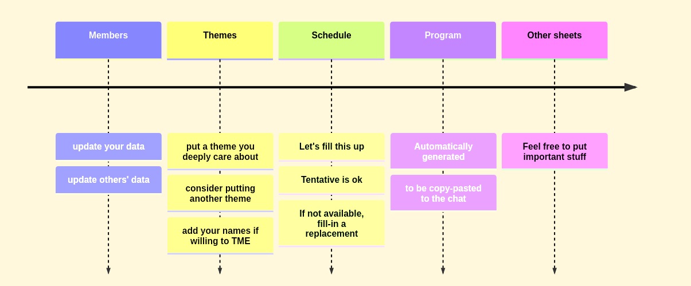
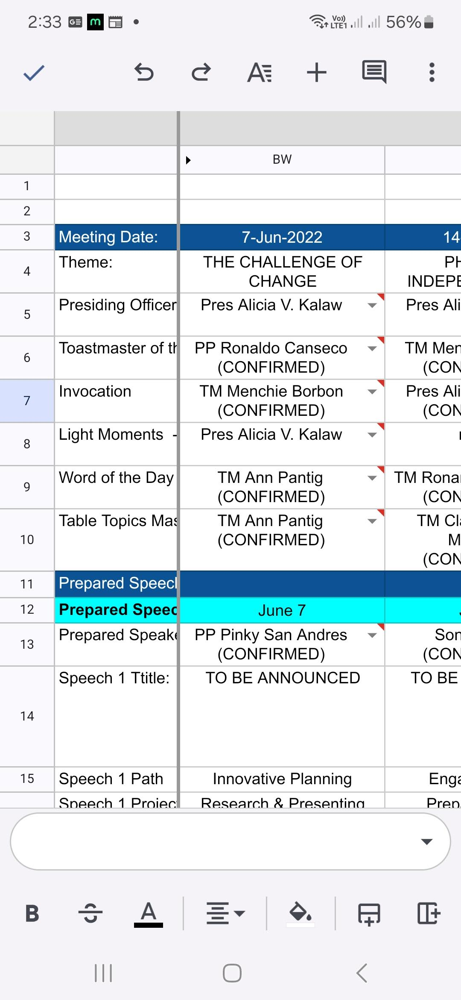
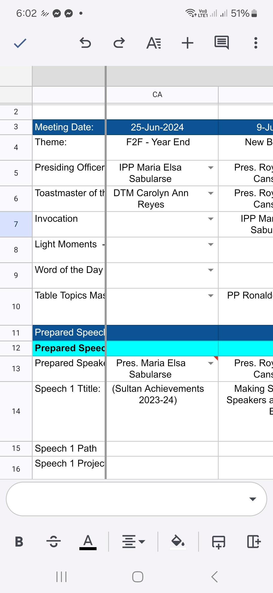
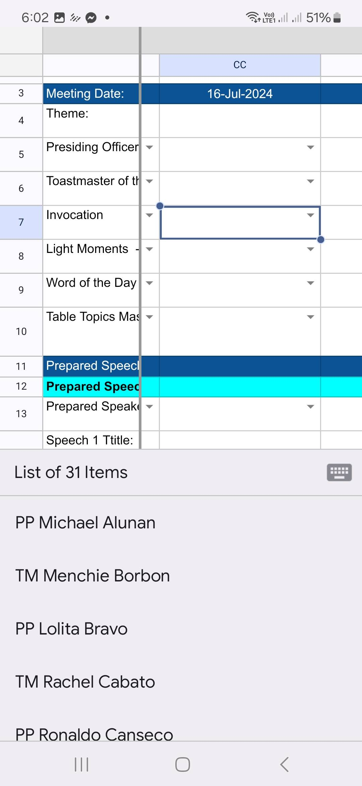
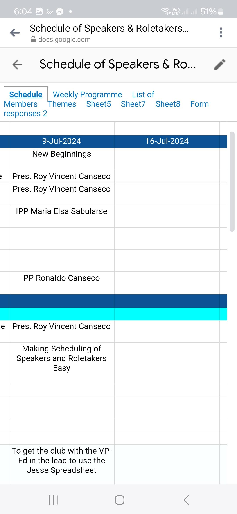
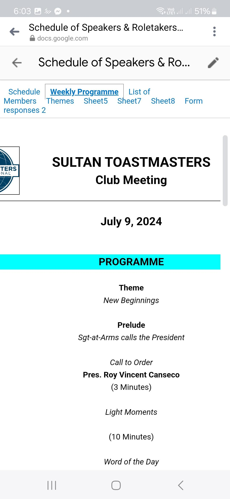
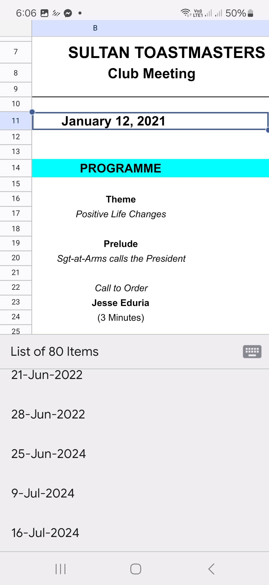

<!-- Add this anywhere in your Markdown file -->

<!-- _footer:  TMI District 75, Division A, Area 1 -->

**Sultan 
Toastmasters Club**

*Chartered 
April 1, 1981*

---

<!-- _footer: - -->

# Speech and Role Scheduler

### *Using the Jesse Spreadsheet*

 Prepared By:

Roy Vincent Canseco, CC VC5  
Sultan Toastmasters Club  
Area 1, Division A, District 75, TMI

---

# Speech Description

I want to talk about the Google spreadsheet that TM Linda mentioned last meeting as a good tool for scheduling speeches and roles. I will show how to use it and how it can help us in our club.

This will also serve as partial fulfillment of the requirements for the Evaluation and Feedback project in Level 1 of the Dynamic Leadership Pathway.

 <button > 

[bit.ly/SultanSched](https://bit.ly/SultanSched) 

</button>

---

<!-- _footer: - -->

# Speech and Role Scheduler

### Sultan Toastmasters 

#### July 9, 2024

 

# 

##### Roy Canseco 

---

# How the scheduler works

---

 <button > 

[bit.ly/SultanSched](https://bit.ly/SultanSched) 

</button>

---

 <button > 

[bit.ly/SultanSched](https://bit.ly/SultanSched) 

</button>

---

 <button > 

[bit.ly/SultanSched](https://bit.ly/SultanSched) 

</button>

---

 <button > 

[bit.ly/SultanSched](https://bit.ly/SultanSched) 

</button>

---

 <button > 

[bit.ly/SultanSched](https://bit.ly/SultanSched) 

</button>

---

 <button > 

[bit.ly/SultanSched](https://bit.ly/SultanSched) 

</button>

---

# Thanks for listening!

### Let's try it out

# -

<button>

[bit.ly/SultanSched](https://bit.ly/SultanSched)

</button>

---

---

timeline
    Members : update your data
    : update others' data
    Themes : put a theme you deeply care about
    : consider putting another theme
    : add your names if willing to TME
    Schedule: Let's fill this up
    : Tentative is ok
    : If not available, fill-in a replacement
    Program: Automatically generated
    : to be copy-pasted to the chat
    Other sheets : Feel free to put important stuff

